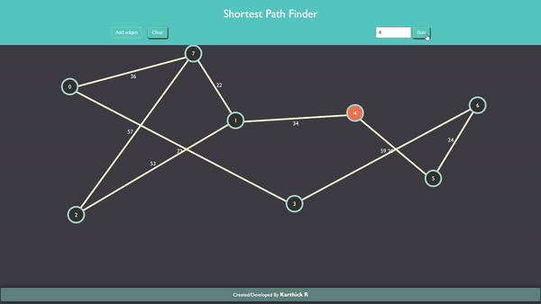

# Graph Visualizer with Dijkstra's Algorithm

## Overview

This project provides a JavaScript-based visual representation of a graph, allowing users to interactively add nodes, create edges, and find the shortest path using Dijkstra's algorithm.

## Demo

<a href="https://rkkarthi07.github.io/Graph_Visualizer/"><strong>➥ Live Demo</strong></a>

## Problem Statement

Create a web application that allows users to visualize different pathfinding algorithms, such as
Dijkstra's or Breadth-First Search (BFS), on a grid. Users should be able to draw obstacles
on the grid and observe how the selected algorithms find the shortest path between two points.

## Features

- Add nodes by clicking on the drawing area.
- Create edges between nodes to establish connections.
- Find the shortest path from a specified source node using Dijkstra's algorithm.
- Visualize the shortest path with highlighted edges.

## Usage

- Click on the drawing area to create nodes.
- Click the "Add Edge" button to start adding edges.
- Click on two nodes to create an edge between them.
- Click the "Run" button to find the shortest path.
- View the results in the path section.

## License

This project is licensed under the [MIT License](LICENSE).

## Acknowledgments

- The project uses Dijkstra's algorithm for finding the shortest path in a graph.

## Contact

For questions or inquiries, please contact [Your Name](mailto:rkkarthick68@example.com).
